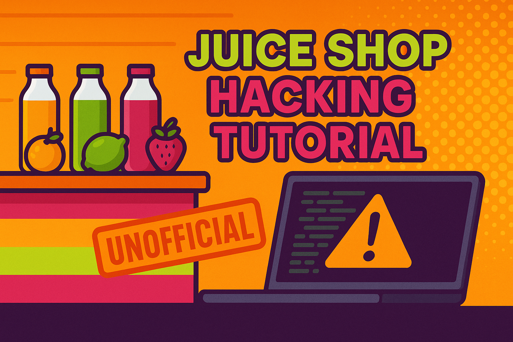

# 🧃 OWASP Juice Shop - Lösungswege



## 📋 Übersicht

Dieses Repository dokumentiert verschiedene Lösungswege für Sicherheitslücken in der **OWASP Juice Shop** Anwendung. Die Juice Shop ist eine absichtlich verwundbare Webanwendung, die zu Schulungszwecken entwickelt wurde, um das Verständnis für Web-Sicherheit zu fördern.

## 🎯 Zweck

- **Bildung**: Verstehen von Web-Sicherheitslücken und deren Ausnutzung
- **Praxis**: Hands-on Erfahrung mit realen Sicherheitsproblemen
- **Dokumentation**: Strukturierte Lösungswege für verschiedene Challenges

## 📂 Projektstruktur

```
Saftladen/
├── README.md                    # Diese Datei
├── PWND.md                      # Hauptdokumentation der Lösungswege
└── ressources/                  # Zusätzliche Ressourcen
    ├── scripts/                 # Hilfsskripte für verschiedene Angriffe
    │   ├── fake_file_1_rename-extension.sh
    │   ├── fake_file_2_magic-bytes-spoofing.sh
    │   └── test.pdf
    └── wordlists/              # Wortlisten für Brute-Force Angriffe
        └── common.txt
```

## 🔓 Dokumentierte Sicherheitslücken

### 1. **SQL Injection**
- Umgehung der Login-Authentifizierung durch SQL-Injection
- Verwendung von speziellen Zeichen um SQL-Queries zu manipulieren

### 2. **Directory Traversal**
- Entdeckung versteckter Verzeichnisse und Dateien
- Verwendung von Tools wie `gobuster` für automatisiertes Scanning

### 3. **Admin Panel Discovery**
- Verschiedene Methoden zur Entdeckung versteckter Admin-Routen
- JavaScript-basierte Analyse der Angular-Anwendung
- DOM-Manipulation und Route-Discovery

### 4. **File Upload Vulnerabilities**
- Umgehung von Dateiformat-Beschränkungen
- Magic Bytes Spoofing
- Extension Manipulation

## 🛠️ Verwendete Tools

- **gobuster**: Directory und File Discovery
- **Browser DevTools**: JavaScript Execution und DOM-Analyse
- **Bash Scripts**: Automatisierung von Exploits
- **cURL/fetch**: API-Interaktion

## 📚 Lernziele

1. **Verständnis von Sicherheitslücken**: Wie entstehen sie und warum sind sie gefährlich?
2. **Exploit-Techniken**: Praktische Anwendung von Angriffsmethoden
3. **Defensive Programmierung**: Was können Entwickler tun, um diese Lücken zu vermeiden?
4. **Security Testing**: Wie testet man Anwendungen auf Sicherheitslücken?

## ⚠️ Wichtiger Hinweis

Diese Dokumentation dient **ausschließlich Bildungszwecken**. Die hier gezeigten Techniken dürfen nur in kontrollierten Umgebungen (wie der lokalen Juice Shop Installation) oder mit ausdrücklicher Erlaubnis angewendet werden. 

**Niemals auf fremden Systemen ohne Erlaubnis testen!**

## 🚀 Erste Schritte

1. **Juice Shop installieren**: 
   ```bash
   docker run --rm -p 3000:3000 bkimminich/juice-shop
   ```

2. **Anwendung öffnen**: 
   ```
   http://localhost:3000
   ```

3. **Lösungswege studieren**: 
   - Beginne mit `PWND.md` für detaillierte Anleitungen
   - Nutze die Scripts im `ressources/scripts/` Ordner

## 📖 Weiterführende Ressourcen

- [OWASP Juice Shop Projekt](https://owasp.org/www-project-juice-shop/)
- [OWASP Top 10](https://owasp.org/www-project-top-ten/)
- [Juice Shop Buch](https://pwning.owasp-juice.shop/)

## 🤝 Beitragen

Wenn du weitere Lösungswege oder Verbesserungen hast, erstelle gerne einen Pull Request oder öffne ein Issue.

## 👨‍💻 Entwickler

**Martin Pfeffer**

## 📄 Lizenz

Dieses Projekt ist unter der MIT-Lizenz lizenziert - siehe die [LICENSE](LICENSE) Datei für Details.

MIT License

Copyright (c) 2024 Martin Pfeffer

Permission is hereby granted, free of charge, to any person obtaining a copy
of this software and associated documentation files (the "Software"), to deal
in the Software without restriction, including without limitation the rights
to use, copy, modify, merge, publish, distribute, sublicense, and/or sell
copies of the Software, and to permit persons to whom the Software is
furnished to do so, subject to the following conditions:

The above copyright notice and this permission notice shall be included in all
copies or substantial portions of the Software.

THE SOFTWARE IS PROVIDED "AS IS", WITHOUT WARRANTY OF ANY KIND, EXPRESS OR
IMPLIED, INCLUDING BUT NOT LIMITED TO THE WARRANTIES OF MERCHANTABILITY,
FITNESS FOR A PARTICULAR PURPOSE AND NONINFRINGEMENT. IN NO EVENT SHALL THE
AUTHORS OR COPYRIGHT HOLDERS BE LIABLE FOR ANY CLAIM, DAMAGES OR OTHER
LIABILITY, WHETHER IN AN ACTION OF CONTRACT, TORT OR OTHERWISE, ARISING FROM,
OUT OF OR IN CONNECTION WITH THE SOFTWARE OR THE USE OR OTHER DEALINGS IN THE
SOFTWARE.

---

**Remember**: Mit großer Macht kommt große Verantwortung! 🦸‍♂️